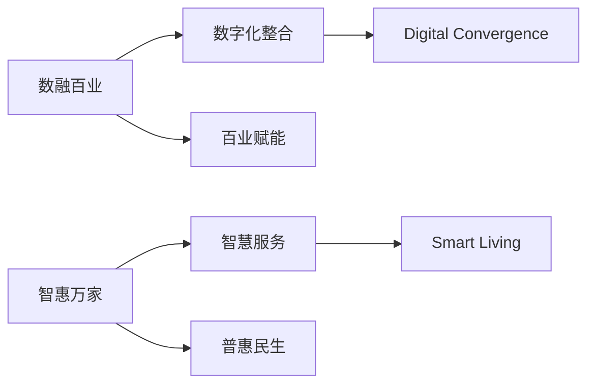

# 数融百业·智惠万家 / Digital Convergence · Smart Living - 项目开发文档

## 项目概述

### 项目信息
- **显示名称**：数融百业·智惠万家
- **Git项目名**：dcsl-wechat-platform
- **英文名称**：Digital Convergence · Smart Living (DC-SL)
- **项目代号**：DC-SL

### 公众号信息
- **名称**：数融百业·智惠万家 (DC-SL)
- **口号**：数融百业·智惠万家
- **核心理念**：以数字化为核心，以数据要素为驱动，整合本地生活服务资源，赋能产业升级
- **服务对象**：
  - B端：企业管理者、行业研究人员
  - G端：政府决策者、各委办局 
  - C端：关注数字经济、智慧城市的公众
- **调性**：专业、权威、前瞻、实践导向

### 平台构成
1. **管理后台**：面向运营人员的内容管理系统
2. **公众号H5**：面向终端用户的服务门户
3. **API服务**：统一的后端服务支撑

## 公众号功能设计

### 菜单结构
```
● 一级菜单1：数智策源
  ○ 宏观视野：政策解读、产业规划分析
  ○ 前沿研报：研究报告、行业白皮书
  ○ 核心技术：大数据、AI、区块链应用
  ○ 专家圆桌：专访、对话

● 一级菜单2：场景赋能
  ○ 文旅一体化：智慧商圈、消费大会员
  ○ 大健康服务：智慧体育、家庭护理
  ○ 智慧出行：出租车、网约车服务
  ○ 政企福利：工会福利、城市消费券
  ○ 城市信用：信用+金融、信易贷
  ○ 数据要素应用：行业实践案例

● 一级菜单3：链接未来
  ○ 品牌故事：公司历程、价值观
  ○ 人才招募：招聘信息
  ○ 活动中心：会议沙龙
  ○ 商务合作：联系方式
```

## 项目标识


## 技术栈

- 前端：Vue 3 + Vite + Pinia + Element Plus (管理端) / Vant (H5端)
- 后端：Node.js + Express + Prisma + JWT
- 数据库：SQLite (开发) / MySQL (生产) + Redis缓存
- 微信集成：wechat-api / wechat-oauth SDK + 微信支付SDK
- 测试：Vitest (前端) + Jest (后端)

## 目录结构规范
### 前端项目
```
src/
├── api/                # API请求封装
│   ├── auth/           # 认证相关API
│   │   ├── index.js    # 接口聚合
│   │   └── types.ts    # 类型定义
│   ├── user/           # 用户相关API  
│   └── wechat/         # 微信相关API
│       └── config.js   # 微信配置
├── assets/
│   ├── fonts/          # 字体文件
│   ├── images/         # 图片资源
│   └── svg/            # SVG图标
├── components/
│   ├── common/         # 全局通用组件
│   └── business/       # 业务组件
├── composables/
│   ├── useFetch/       # 请求封装
│   │   ├── index.js
│   │   └── retry.js    # 重试逻辑
│   └── useWechat/      # 微信SDK封装
│       ├── sdk.js      # SDK初始化
│       └── hooks.js    # 常用钩子
├── router/
│   ├── index.js        # 路由配置
│   └── routes.js       # 路由定义
├── stores/
│   ├── auth.js         # 认证状态
│   └── user.js         # 用户状态
├── styles/
│   ├── variables.scss  # 样式变量
│   └── global.scss     # 全局样式
├── utils/
│   ├── auth.js         # 认证工具
│   └── request.js      # 请求工具
└── views/
    ├── admin/          # 管理后台页面
    └── h5/             # 移动端页面
```
### 后端项目
```
server/
├── config/
│   ├── database/
│   │   ├── mysql.js    # 生产配置
│   │   └── sqlite.js   # 开发配置
│   └── wechat/
│       ├── official.js # 公众号配置
│       └── payment.js  # 支付配置(保留)
├── controllers/
│   ├── auth.js         # 认证控制器
│   └── user.js         # 用户控制器
├── middleware/
│   ├── auth.js         # 认证中间件
│   └── error.js        # 错误处理
├── models/
│   ├── user.js         # 用户模型
│   └── menu.js         # 菜单模型
├── routes/
│   ├── api.js          # API路由
│   └── wechat.js       # 微信路由
├── services/
│   ├── auth.js         # 认证服务
│   └── wechat.js       # 微信服务
├── utils/
│   ├── jwt.js          # JWT工具
│   └── validator.js    # 验证工具
└── app.js              # 应用入口
```

## 命名规范

### 文件命名

- 使用kebab-case命名法 (例：user-service.js)
- Vue组件使用PascalCase (例：UserAvatar.vue)
- 测试文件添加.test后缀 (例：auth.test.js)

### 代码命名

- 变量/函数：camelCase
- 类名：PascalCase
- 常量：UPPER_CASE
- 私有成员：_前缀
## 微信相关
```
wechat/
├── callback/
│   ├── auth/           # 授权回调
│   │   ├── index.js    # 路由入口
│   │   └── validator.js # 参数验证
│   └── payment/        # 支付回调(保留目录)
├── menu/
│   ├── builder.js      # 菜单构建器
│   └── config.js       # 菜单配置
└── message/
    ├── text.js         # 文本消息处理
    └── event.js        # 事件消息处理
```

## 数据库

```
prisma/
├── migrations/
│   ├── 20230101_init/  # 初始迁移
│   └── 20230201_update/ # 更新迁移
└── schema.prisma       # 数据模型定义
    # 示例模型定义
    model User {
        id        Int     @id @default(autoincrement())
        username  String  @unique
        password  String
    }
```

## 开发规范

### 代码质量

1. 所有API接口必须添加Joi验证和Swagger文档
2. 数据库操作必须使用Prisma客户端，禁止直接SQL
3. 前端组件必须添加TypeScript类型定义

### 微信开发

1. 消息处理需兼容XML和JSON格式
2. 接口调用需实现重试机制
3. 支付回调需验证签名和幂等处理

### 部署要求

1. 生产环境必须配置：
   - Redis缓存
   - 日志收集(ELK)
   - 监控告警(Prometheus)
   - 限流熔断

### 测试要求

1. 核心功能单元测试覆盖率≥80%
2. API接口必须包含集成测试
3. 前端组件需有交互测试
