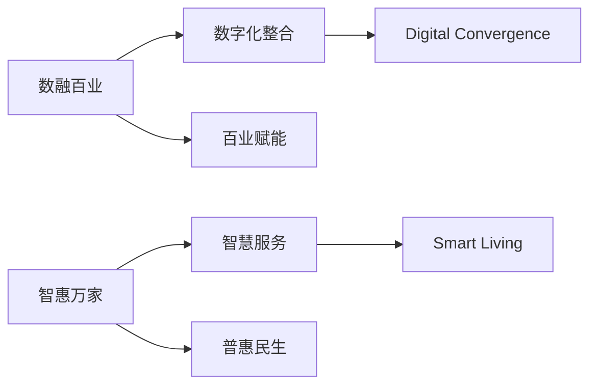

# 数融百业·智惠万家 / Digital Convergence · Smart Living - 项目开发文档

## 项目概述

### 项目信息
- **显示名称**：数融百业·智惠万家
- **Git项目名**：dcsl-wechat-platform
- **英文名称**：Digital Convergence · Smart Living (DC-SL)
- **项目代号**：DC-SL

### 公众号信息
- **名称**：数融百业·智惠万家 (DC-SL)
- **口号**：数融百业·智惠万家
- **核心理念**：以数字化为核心，以数据要素为驱动，整合本地生活服务资源，赋能产业升级
- **服务对象**：
  - B端：企业管理者、行业研究人员
  - G端：政府决策者、各委办局 
  - C端：关注数字经济、智慧城市的公众
- **调性**：专业、权威、前瞻、实践导向

### 平台构成
1. **管理后台**：面向运营人员的内容管理系统
2. **公众号H5**：面向终端用户的服务门户
3. **API服务**：统一的后端服务支撑

## 公众号功能设计

### 菜单结构
```
● 一级菜单1：数智策源
  ○ 宏观视野：政策解读、产业规划分析
  ○ 前沿研报：研究报告、行业白皮书
  ○ 核心技术：大数据、AI、区块链应用
  ○ 专家圆桌：专访、对话

● 一级菜单2：场景赋能
  ○ 文旅一体化：智慧商圈、消费大会员
  ○ 大健康服务：智慧体育、家庭护理
  ○ 智慧出行：出租车、网约车服务
  ○ 政企福利：工会福利、城市消费券
  ○ 城市信用：信用+金融、信易贷
  ○ 数据要素应用：行业实践案例

● 一级菜单3：链接未来
  ○ 品牌故事：公司历程、价值观
  ○ 人才招募：招聘信息
  ○ 活动中心：会议沙龙
  ○ 商务合作：联系方式
```

## 项目标识


## 技术栈

- 前端：Vue 3 + Vite + Pinia + Element Plus (管理端) / Vant (H5端)
- 后端：Node.js + Express + Prisma + JWT
- 数据库：SQLite (开发) / MySQL (生产) + Redis缓存
- 微信集成：wechat-api / wechat-oauth SDK + 微信支付SDK
- 测试：Vitest (前端) + Jest (后端)

## 项目设置

项目包含两个核心部分：前端应用（根目录）和后端服务（`server/`目录）。

- **前端**: 根目录下的 `package.json` 用于管理前端依赖和脚本。
- **后端**: `server/` 目录下的 `package.json` 用于管理后端依赖和脚本。

在开始开发前，请分别在根目录和 `server/` 目录下执行 `npm install` (或 `yarn`, `pnpm`) 来安装所需依赖。

## 目录结构规范

### 前端项目 (`src/`)
前端代码遵循标准的Vue 3 + Vite项目结构，推荐全部使用TypeScript (`.ts`)。
```
src/
├── api/                  # API请求封装
│   ├── auth/             # 认证相关API
│   │   ├── index.ts      # 接口聚合
│   │   └── types.ts      # 类型定义
│   ├── user-api.ts       # 用户相关API
│   └── wechat-api.ts     # 微信相关API
├── assets/
│   ├── fonts/
│   ├── images/
│   └── svg/
├── components/
│   ├── common/           # 全局通用组件 (e.g., AppHeader.vue)
│   └── business/         # 业务组件 (e.g., UserProfile.vue)
├── composables/
│   ├── use-fetch.ts      # 请求封装
│   └── use-wechat-sdk.ts # 微信SDK封装
├── router/
│   ├── index.ts          # 路由配置
│   └── routes.ts         # 路由定义
├── stores/
│   ├── auth-store.ts     # 认证状态
│   └── user-store.ts     # 用户状态
├── styles/
│   ├── variables.scss
│   └── global.scss
├── utils/
│   ├── auth-util.ts      # 认证工具
│   └── request-util.ts   # 请求工具
└── views/
    ├── AdminView/
    └── H5View/
```
### 后端项目 (`server/`)
后端代码采用模块化的Express结构。
```
server/
├── app.js                # 应用入口
├── config/
│   ├── db-config.js      # 数据库配置(生产/开发)
│   └── wechat-config.js  # 微信配置(公众号/支付)
├── controllers/
│   ├── auth-controller.js
│   └── user-controller.js
├── middleware/
│   ├── auth-middleware.js
│   └── error-handler.js
├── routes/
│   ├── index.js          # 路由聚合
│   ├── api-routes.js     # API路由
│   └── wechat-routes.js  # 微信回调与消息路由
├── services/
│   ├── auth-service.js
│   └── user-service.js
├── utils/
│   ├── jwt-util.js
│   └── validator-util.js
└── wechat/                 # 微信核心业务逻辑
    ├── callback/           # 授权与支付回调
    │   ├── auth-callback.js
    │   └── payment-callback.js
    ├── menu/               # 菜单管理
    │   ├── menu-builder.js
    │   └── menu-config.js
    └── message/            # 消息处理器
        ├── event-handler.js
        └── text-handler.js
```

## 命名规范

### 文件命名
- **kebab-case**: 所有 `.js`, `.ts`, `.scss` 文件均使用小写横杠连接 (e.g., `user-service.js`, `auth-store.ts`)。
- **PascalCase**: Vue组件文件使用大驼峰命名 (e.g., `UserAvatar.vue`)。
- **测试文件**: 在原文件名后添加 `.test` 或 `.spec` (e.g., `user-service.test.js`)。

### 代码命名
- **camelCase**: 变量、函数名。
- **PascalCase**: 类、类型定义 (Interfaces, Types)。
- **UPPER_CASE**: 全局常量、枚举值。
- **_prefix**: 私有或内部成员（约定）。

## 数据库

```
prisma/
├── migrations/
│   ├── 20230101_init/  # 初始迁移
│   └── 20230201_update/ # 更新迁移
└── schema.prisma       # 数据模型定义
    # 示例模型定义
    model User {
        id        Int     @id @default(autoincrement())
        username  String  @unique
        password  String
    }
```

## 开发规范

### 代码质量

1. 所有API接口必须添加Joi验证和Swagger文档
2. 数据库操作必须使用Prisma客户端，禁止直接SQL
3. 前端组件必须添加TypeScript类型定义

### 微信开发

1. 消息处理需兼容XML和JSON格式
2. 接口调用需实现重试机制
3. 支付回调需验证签名和幂等处理

### 部署要求

1. 生产环境必须配置：
   - Redis缓存
   - 日志收集(ELK)
   - 监控告警(Prometheus)
   - 限流熔断

### 测试要求

1. 核心功能单元测试覆盖率≥80%
2. API接口必须包含集成测试
3. 前端组件需有交互测试
